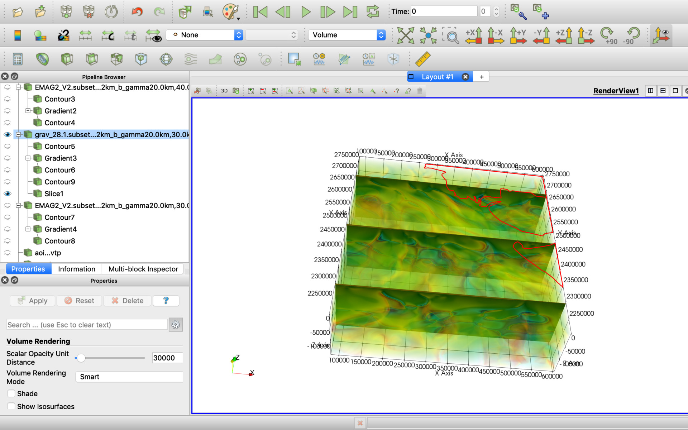

# ParaView-OffshoreIndus
[ParaView](https://www.paraview.org/download/) project for geological exploration on the offshore Indus Basin, Pakistan.

See LinkedIn posts for more details:

[See 3D models from Sandwell & Smith Gravity, EMAG v.2 with a depth of 150 km for the offshore Indus Basin, Pakistan](https://www.linkedin.com/posts/activity-6612328034529751040-XiGd/)

# How it looks

There are multiple data cubes and sections in the project which could be enabled manually. See below the project screenshots:

# How to open the project

Use [ParaView](https://www.paraview.org/download/) File -> Load State menu item to load the PakistanInd.pvsm project file and specify "data" subdirectory as "Data Directory" as on the screen below:

